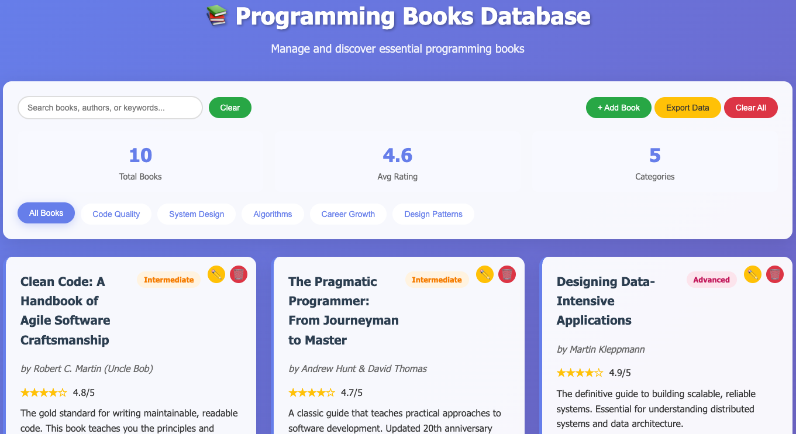

# Programming Books Database
## Screenshot


<p align="center">
   
</p>


A modern web app to manage and discover essential programming books. This project is split into a frontend (static HTML/CSS/JS) and a backend (Node.js/Express REST API).

## Features
- Browse, search, filter, add, edit, and delete programming books
- Book details: title, author, difficulty, rating, description, highlights, categories
- Responsive, modern UI
- Data export (JSON)
- Backend API for persistent data
- Error message if backend is unreachable

## Project Structure
```
books-database/
├── backend/         # Node.js/Express backend API
│   ├── server.js
│   ├── package.json
│   └── ...
├── frontend/        # Static frontend (HTML, CSS, JS)
│   ├── index.html
│   ├── style.css
│   └── app.js
├── .gitignore
└── README.md
```

## Getting Started

### Backend
1. Install dependencies:
   ```sh
   cd backend
   npm install
   ```
2. Start the backend server:
   ```sh
   npm start
   ```
   The API will be available at `http://localhost:3001/api/books`.

### Frontend
1. Open `frontend/index.html` in your browser.
   - For best results, use a local server (e.g. `npx serve frontend` or VS Code Live Server extension).
2. The app will connect to the backend API for all book data.

## API Endpoints
- `GET    /api/books`         — List all books
- `GET    /api/books/:id`     — Get a single book
- `POST   /api/books`         — Add a new book
- `PUT    /api/books/:id`     — Update a book
- `DELETE /api/books/:id`     — Delete a book
- `DELETE /api/books`         — Delete all books

## Customization
- To seed with your own books, edit the `seedInitialData()` function in `backend/server.js`.
- To change categories, update the frontend checkboxes and backend data accordingly.

## License
MIT

---

Made with ❤️ by [kirilan1024](https://github.com/kirilan1024) and GitHub Copilot
